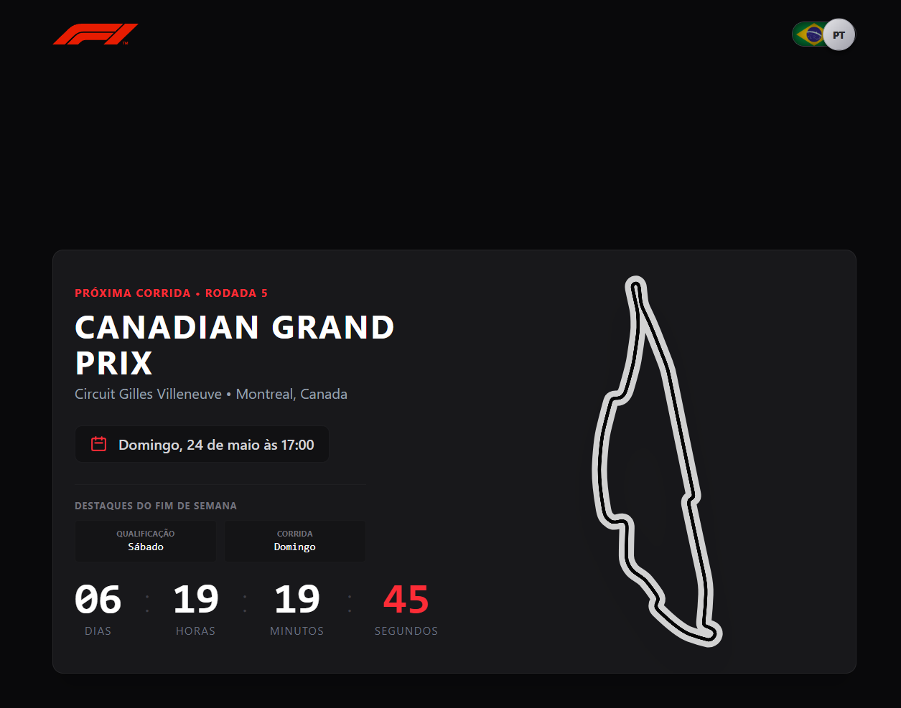
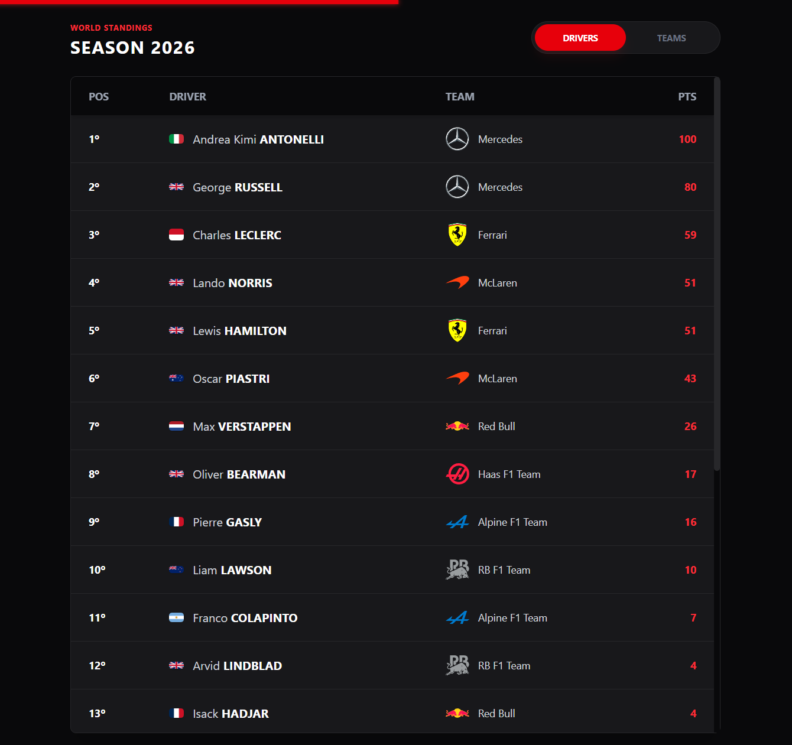
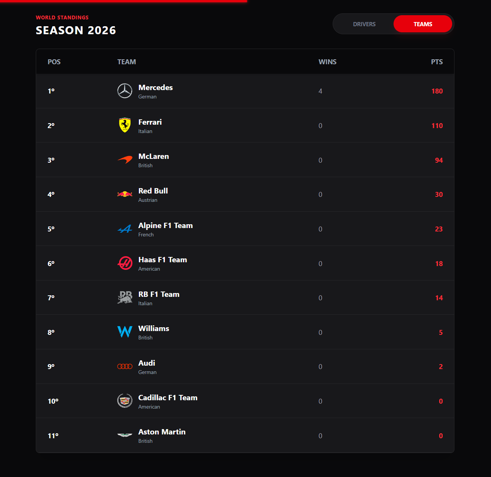
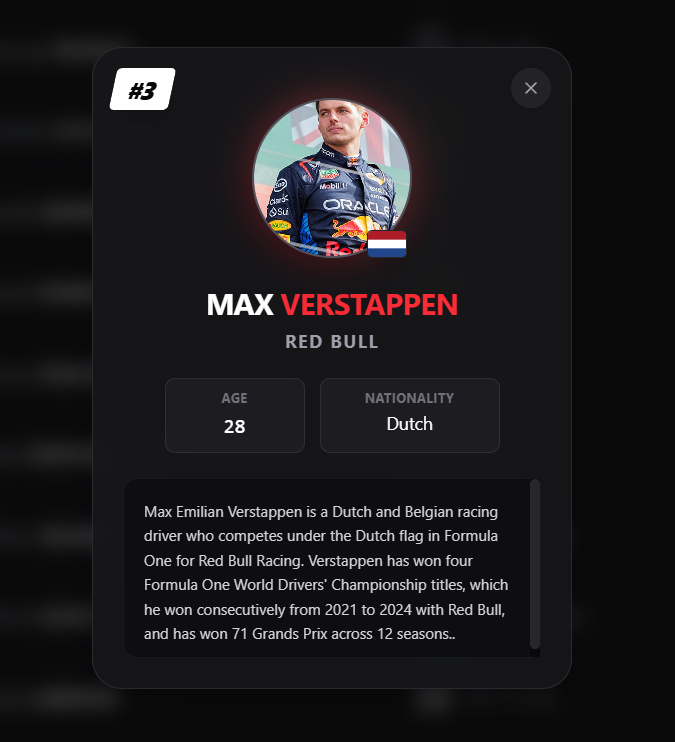
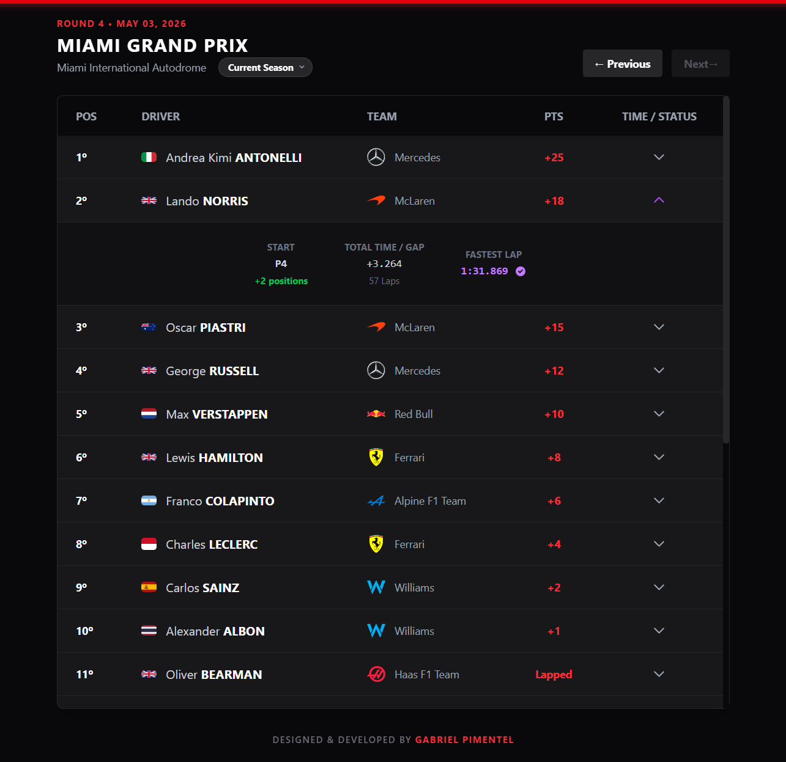

# 🏎️ F1 PRO Dashboard - Temporada Atual

Um painel interativo e responsivo para acompanhamento em tempo real da temporada de Fórmula 1. Desenvolvido com foco extremo em performance, acessibilidade e com uma estética dark inspirada em dashboards reais de telemetria das equipes.

🚀 **Acesse o projeto online:** [https://f1dash.pages.dev/](https://f1dash.pages.dev/)

---

## 🌟 Principais Features e Diferenciais

O projeto foi arquitetado para proporcionar uma experiência de **App Nativo** diretamente no navegador, utilizando conceitos avançados de UI/UX e React:

- 🚦 **Preloader Imersivo:** Animação de carregamento inicial simulando as 5 luzes vermelhas de largada da F1.
- 📱 **Experiência "App-Like" (Scroll Snap):** Navegação vertical mandatória que trava a tela em seções específicas, garantindo aproveitamento total da tela (Screen Real Estate), ideal para mobile.
- 🌍 **Internacionalização Persistente (i18n):** Sistema de tradução instantânea e sem recarregamento (Context API). A interface alterna fluidamente entre Português e Inglês com transições de opacidade, salvando a preferência do usuário no `localStorage`.
- 🛡️ **Resiliência e Tratamento de Erros:** Fallbacks de interface elegantes caso ocorram falhas de conexão ou timeouts nas APIs de dados, impedindo que o layout quebre.
- 🎨 **Mobile First & Design Responsivo:** Adaptação inteligente de elementos visuais (ex: bandeiras de países no Desktop se transformam em logos compactos de equipes no Mobile) priorizando a legibilidade.

---

## 📸 Visão Geral das Seções

### 1. Próxima Corrida (Next Race)
O ponto de entrada do usuário. Traz informações críticas sobre o próximo evento do calendário, formatando a data e o horário automaticamente com base no fuso do usuário e no idioma selecionado.
- Contagem regressiva em tempo real.
- Layout dinâmico do traçado do circuito em formato SVG com animação de trajeto.

   

### 2. Classificação Mundial (Standings)
Uma visão completa e dividida da tabela de pontos atualizada, renderizada com animações suaves de fade-in.
- **Pilotos & Equipes:** Tabelas completas com cálculo de diferenças de pontos, logotipos oficiais e bandeiras.
- **Wikipédia Dinâmica (Modal):** Ao clicar em um piloto, um modal interativo é aberto. Ele consome a API oficial da Wikipédia (buscando em `pt` ou `en` dinamicamente) para extrair foto, biografia e estatísticas, burlando bloqueios de limite de requisição com renderização nativa de imagens.

  
    
  
    
  

### 3. Resultados da Temporada (Last Races)
Um arquivo histórico navegável de todas as corridas que já ocorreram no ano.
- Navegação rápida entre as etapas usando botões e selects integrados.
- Destaque visual automático para a "Volta Mais Rápida" (Purple Lap).
- **Telemetria Expansível (Accordion):** Ao clicar em um piloto na tabela, a linha se expande revelando: posição de largada, posições ganhas/perdidas, tempo total, penalidades de pit-lane e velocidade média da melhor volta.

   

---

## 🏗️ Arquitetura e Boas Práticas

Este projeto foi construído seguindo princípios de **Clean Code**:
- **Separação de Responsabilidades:** Funções lógicas de mapeamento (`f1-utils.ts`) isoladas dos componentes visuais.
- **Dicionário de Dados:** Textos abstraídos em `dictionaries.ts` para facilitar a escalabilidade de novos idiomas.
- **Tipagem Estrita:** Uso rigoroso de interfaces TypeScript (`types/f1.ts`) para garantir confiabilidade no consumo das APIs.
- **Otimização de Imagens:** Uso extensivo do componente `<Image>` do Next.js e atributos `loading="lazy"` para manter a nota máxima no Lighthouse (Performance e SEO).

---

## 🛠️ Tecnologias e Ferramentas

- **Core:** [Next.js](https://nextjs.org/) (App Router), [React](https://react.dev/), [TypeScript](https://www.typescriptlang.org/)
- **Estilização:** [Tailwind CSS](https://tailwindcss.com/)
- **Requisições:** [Axios](https://axios-http.com/)
- **Hospedagem:** [Cloudflare Pages](https://pages.cloudflare.com/)

### 🔌 APIs Consumidas
- **[Ergast API (via Jolpi)](https://ergast.com/mrd/):** Fornece os dados brutos de calendários e classificações oficiais da FIA.
- **[Wikimedia REST API](https://www.mediawiki.org/wiki/API:REST_API):** Enriquecimento do modal dos pilotos com fotos e resumos biográficos.
- **[Flagcdn](https://flagcdn.com/):** Renderização ultrarrápida das bandeiras de nacionalidades.
- **[UI-Avatars](https://ui-avatars.com/):** Sistema de fallback (letras iniciais) caso o piloto não possua imagem pública na Wikipédia.

---

## 👤 Autor

**Gabriel Henrique Ferreira Pimentel**
- 🌐 [Portifólio](https://gabrielpimentel.vercel.app/)
- 💼 [LinkedIn](https://www.linkedin.com/in/gabrielhfpimentel/)